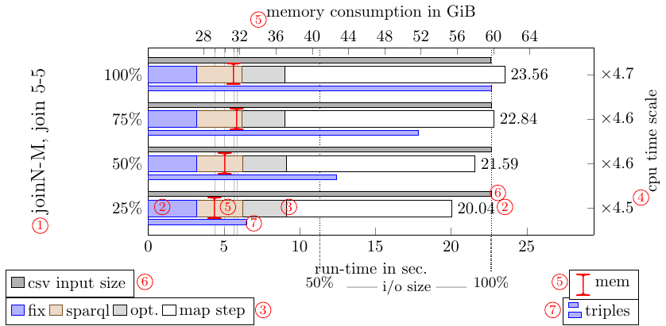
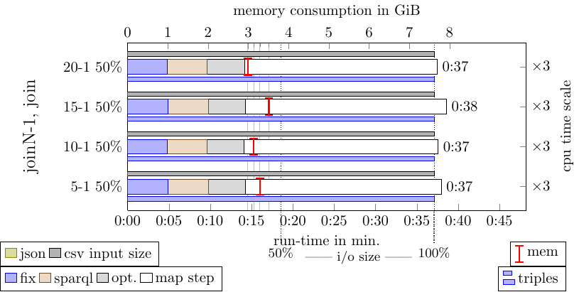
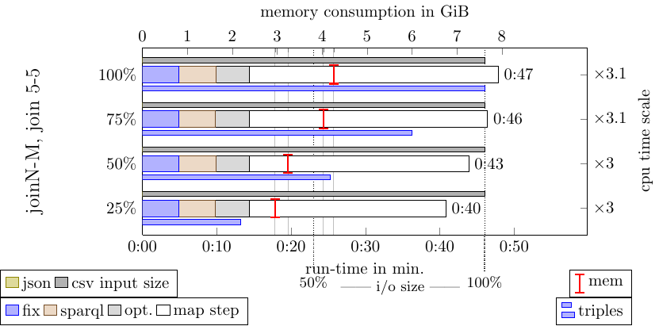

# KGCW at ESWC 2024 Results for the RPT/SANSA RML Engine

* Scripts for generating the plots from the source data are in the [scripts](scripts) folder.
* The RML engine is part of [RdfProcessingToolkit](https://github.com/SmartDataAnalytics/RdfProcessingToolkit).
* This is a re-run of the [2023 Benchmark](../2023-05-28-KGCW-at-ESWC), but on the VM sponsored by Orange.

## Benchmark system

These results were obtained by running RdfProcessingToolkit on the VM sponsored by Orange:

| Hardware    |                                    |
+-------------+------------------------------------+
| CPU         | Intel(R) Xeon(R) Gold 6161 CPU     |
| Threads     | 4                                  |
| RAM         | 16 GiB                             |
| Java memory | 5 GiB                              |
| Harddisk    | VMware virtual disk                |
| Disk Size   | 136 GB                             |

Thus we can compare how RPT works on weaker hardware.

## How to read the plots.

The following plots summarize the statistics obtained in the challenge.

Each of the following plots captures all of the following information.
In order to assist the reader, we added circled numbers to Figure 1 which correspond to the
numbers of this list:
1. The challenge was organised into multiple directories with different tasks. The parent
directory/task is displayed on the left outer legend, the left y-axis shows the directory/dif-
ferent parameter configurations for this task.
2. The thick bar next to the parameter configuration is the main bar. It records the run-time
of RPT. The total run-time in seconds is also printed at the end of the bar, and the run-time
is also displayed on the bottom x-axis.
3. Each task “pipeline” can be configured to consist of multiple steps. We configured RPT to
use six steps, the duration of each step corresponding to the different coloured segments on
the main bar. (1) fix the mappings (see section 2.1), (2) configure the CSV “NULL” value
(meaning unbound in SPARQL), (3) run the XML mappings (not parallelised), (4) convert
the RML mapping into an equivalent SPARQL SERVICE query (see [1]), (5) run source
optimisation on the SPARQL query, (6) execute the SPARQL query mapping description
using RPT/Sansa.
4. The right y-axis shows the CPU time scale factor. This shows the distributedness of the
execution (higher = more distributed). It was calculated by dividing the CSV column
`cpu_user_system_diff` by the duration.
5. A red *Ꮖ* mark shows the value of the `memory_ram_max` CSV column (memory consumption).
The memory consumption is also displayed on the top x-axis. Note, that the measurement
has very limited informative value because the tool captures the initial virtual memory
claimed by the Java Virtual Machine (JVM, 28 GiB) and not the actually used memory.
We have no reason to suspect that less memory would be a problem for RPT.
6. The small bar above the main bar and . . .
7. the small bar below the main bar are to be read from top to bottom. They display the
relative size of the input data on top and the relative size of the output triple count on
the bottom of the main bar (blue). In the case of heterogeneous input formats, the top bar
is colour coded for the size of the XML, JSON and CSV input. Note that while the raw
numbers are absolute, the plot only gives

## All plots

### gtfs-heterogeneity

### gtfs-scale.

### empty-value

### duplicated-values

### records

### properties 

### mappings

### joins-1-1

### joins-1-N-50

### joins-1-10

### joins-N-1-50

### joins-10-1

### join-N-M

### join-5-5

### gtfs-scale-no-log

### records-no-log

